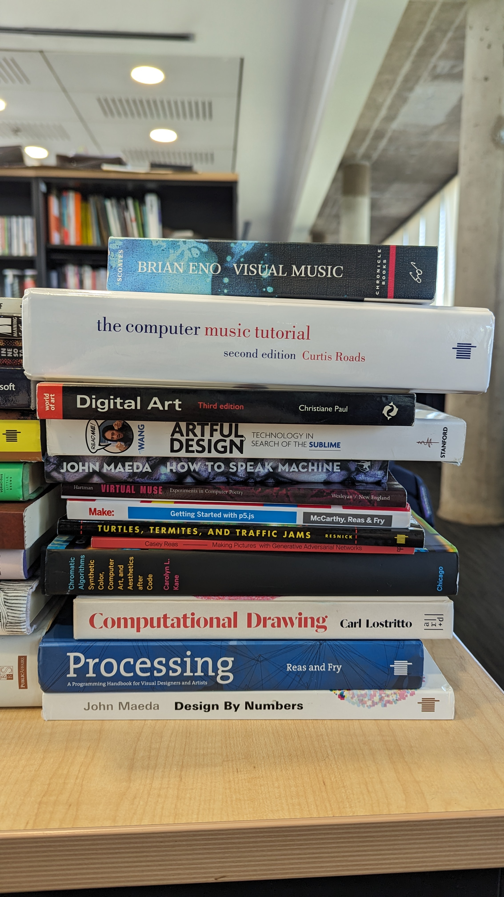

# dis9034-2024-1

## acerca de

- universidad: Universidad Diego Portales
- facultad: Facultad de Arquitectura, Arte y Diseño
- departamento: Departamento de Diseño
- curso: DIS9034 Programación creativa multimedia
- sección: 01
- créditos: 05
- semestre: primer semestre 2024
- profesore: [aarón montoya-moraga](https://github.com/montoyamoraga/)
- ayudante: [janis sepúlveda](https://github.com/janisepulveda)
- estudiantes inscritos: 22

## repositorio

- [clases](./clases/): una subcarpeta por cada clase con los apuntes hechos por el equipo docente
- [estudiantes](./estudiantes/): una subcarpeta por cada estudiante con sus apuntes y entregas de solemnes y examen.

## asistencia

la asistencia a clases es obligatoria. si no pueden asistir a clases, por favor avisar vía correo electrónico al equipo docente.

cada clase, su asistencia puede tener estos valores:

- 1.0: asistencia a tiempo y total
- 0.7: asistencia con problemas al inicio o al final
- 0.5: asistencia con problemas al inicio y al final
- 0.3: asistencia con problemas al inicio y al final y durante
- 0.0: inasistencia

## evaluaciones

- tendrán 2 evaluaciones antes del examen, son:
  - solemne 01
  - solemne 02
- su nota de presentación al examen será el promedio de ambas solemnes
- pueden dar el examen si su nota de presentación es mayor o igual a 4.0 y si su asistencia es >= 70%
- si su asistencia es menor a 70%, el curso se reprueba con el mínimo entre 3.9 y su nota de presentación
- si pueden dar el examen, su nota final será 70% nota de presentación + 30% nota del examen

puntos extra:

- si suben a su carpeta de estudiantes un archivo en Markdown con un resumen de uno de los libros
  de la bibliografía física y hacen una presentación de 05 minutos en clases, tendrán un punto adicional en una solemne. pueden hacer esto solamente una vez por solemne.

## contenidos

durante el semestre abordaremos estos contenidos:

- lenguajes de programación

  - variables, arreglos
  - bucles, condiciones
  - funciones, objetos
  - lenguaje Python y su aplicación en texto, audio, imagen y video
  - lenguaje JavaScript, herramienta p5.js, y su aplicación en imagen y diseño de interacción

- programación creativa de imágenes

  - pixeles y buffers
  - filtros y glitch
  - resolución y video

- programación creativa de audio

  - tiempo y reactividad
  - formatos de audio

- protocolos y diseño de interacción
  - MIDI
  - OpenSoundControl
  - interactividad con periféricos (ratón, teclado)

## clases (lunes 02:30pm-05:20pm)

| clase                  | fecha      | tema                               |
| :--------------------- | :--------- | :--------------------------------- |
| [01](clases/clase-01/) | 2024-03-11 | historia y stack tecnológico       |
| [02](clases/clase-02/) | 2024-03-18 | variables, arreglos y bucles       |
| [03](clases/clase-03/) | 2024-03-25 | condicionales, funciones y pixeles |
| [04](clases/clase-04/) | 2024-04-01 | preparación solemne                |
| [05](clases/clase-05/) | 2024-04-08 | solemne 01 en clase                |
| [06](clases/clase-06/) | 2024-04-15 | video e interactividad             |
| [07](clases/clase-07/) | 2024-04-22 | audio e interactividad             |
| [08](clases/clase-08/) | 2024-04-29 | detección de presencia humana      |
| [09](clases/clase-09/) | 2024-05-13 | preparación solemne 02             |
| [10](clases/clase-10/) | 2024-05-20 | solemne 02 en clase                |
| [11](clases/clase-11/) | 2024-05-27 | JSON y API de Wikipedia            |
| [12](clases/clase-12/) | 2024-06-03 | API de MoMA                        |
| [13](clases/clase-13/) | 2024-06-10 | aleatoreidad                       |
| [14](clases/clase-14/) | 2024-06-17 | preparación examen                 |
| [15](clases/clase-15/) | 2024-06-24 | examen en clase                    |

## comunicación

- vía mail
- copiando a todo el equipo docente:
  - <aaron.montoya@mail.udp.cl>
  - <janis.sepulveda@mail.udp.cl>
- con asunto "DIS9034 - X", reemplazando X por la descripción, y sin las comillas!

cualquier comunicación que no cumpla con esto no será respondida.

## bibliografía web

- <https://developer.mozilla.org/en-US/>
- <https://www.w3schools.com/>
- <https://p5js.org/>
- <https://processingfoundation.press/>

## bibliografía física

en mi oficina tienen acceso a estos libros, si los van a tomar prestados, por favor avisar por correo a todo el equipo docente.

