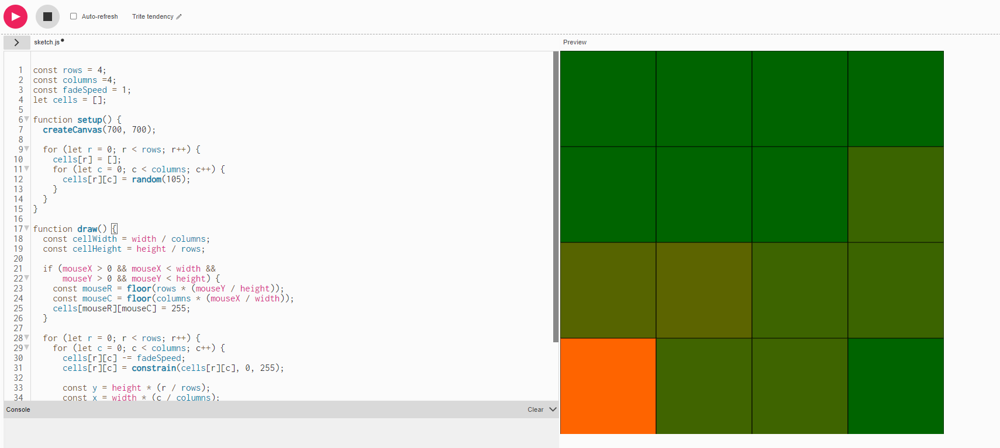

# clase-14

EXAMEN primera clase idea

Mi proyecto de examen será hacer un juego parecido al rompecabezas interactivo completando los patrones.
Idea con una ilustración propia

Referentes:

- <https://editor.p5js.org/saamia123/sketches/_hSHC1LGw>
- <https://happycoding.io/tutorials/p5js/arrays/fading-grid>
- <https://editor.p5js.org/KevinWorkman/sketches/7PvZ_jOrO>
- <https://happycoding.io/tutorials/p5js/images/image-tiles>
- <https://editor.p5js.org/Falcyon/sketches/aZi-waXC_>

