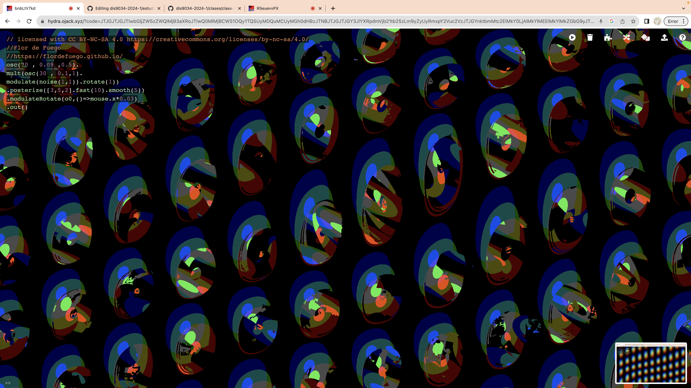
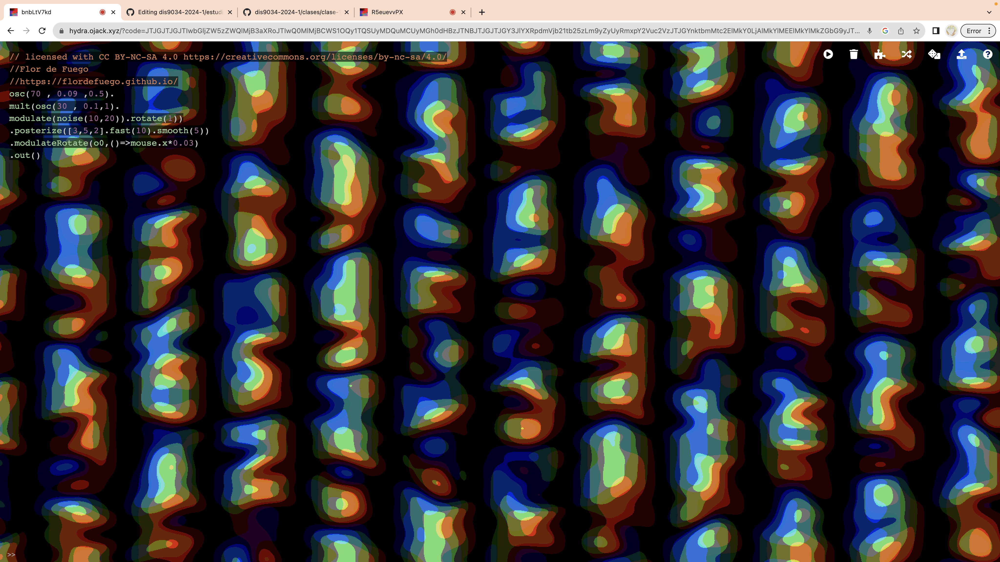
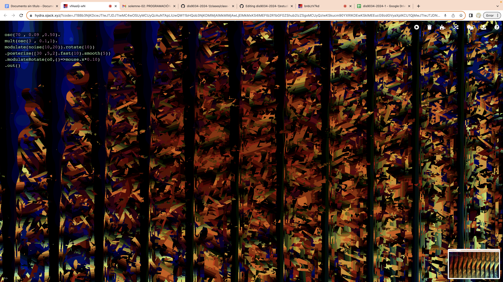
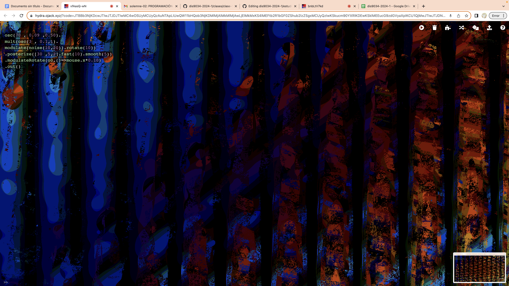

# clase-10

## Formas de uso

- CTRL-Enter: ejecuta una línea de código
- CTRL-Shift-Enter: ejecuta todo el código en la pantalla
- ALT-Enter: ejecutar un bloque
- CTRL-Shift-H: ocultar o mostrar código
- CTRL-Shift-F: formatear código usando Prettier
- CTRL-Shift-S: guardar captura de pantalla y descargarla como archivo local
- CTRL-Shift-G: Compartir en Twitter (si está disponible). Comparte en @hydra_pattern


renderice un oscilador con parámetros de frecuencia, sincronización y compensación rgb:
```
. osc(20, 0.1, 0.8).out()
```
gire el oscilador 0,8 radianes:
```
. osc(20, 0.1, 0.8).rotate(0.8).out()
```
pixelar la salida de la función anterior:
```
. osc(20, 0.1, 0.8).rotate(0.8).pixelate(20, 30).out()
```
mostrar la salida de la cámara web:
```
. s0.initCam() // initialize a webcam in source buffer s0
. src(s0).out() // render source buffer s0
```
Si tiene más de una cámara conectada, puede seleccionar la cámara usando un índice:
```
. s0.initCam(1) // initialize a webcam in source buffer s0
```
caleidoscopio de cámara web:
```
. s0.initCam() // initialize a webcam in source buffer s0
. src(s0).kaleid(4).out() // render the webcam to a kaleidoscope
```
También puedes componer varias fuentes juntas:
```
. osc(10)
. rotate(0.5)
. diff(osc(200))
. out()
```
- De forma predeterminada, el entorno contiene cuatro búferes de salida independientes, cada uno de los cuales puede representar gráficos diferentes. A las salidas se accede mediante las variables o0, o1, o2 y o3.
  para renderizar en el buffer de salida o1:
```
. osc().out(o1)
. render(o1) // render the contents of o1
```
- Si no se especifica ninguna salida en out(), los gráficos se representan en el búfer o0. para mostrar todos los buffers de renderizado a la vez:
```
. render()
```
- Los buffers de salida luego se pueden mezclar y componer para producir lo que se muestra en la pantalla.
```
. s0.initCam() // initialize a webcam in source buffer s0
. src(s0).out(o0) // set the source of o0 to render the buffer containing the webcam
osc(10, 0.2, 0.8).diff(o0).out(o1) // initialize a gradient in output 
. buffer o1, composite with the contents of o0
. render(o1) // render o1 to the screen
```
- Las funciones compuestas blend(), diff(), mult() y add() realizan operaciones aritméticas para combinar el color de la textura de entrada con el color de la textura base, similar a los modos de fusión de Photoshop.
  
modular(textura, cantidad) utiliza los canales rojo y verde de la textura de entrada para modificar las coordenadas xey de la textura base. Más sobre modulación en: https://lumen-app.com/guide/modulation/
```
. osc(21, 0).modulate(o1).out(o0)
. osc(40).rotate(1.57).out(o1)
```
Utilice un vídeo como fuente:
```
. s0.initVideo("https://media.giphy.com/media/AS9LIFttYzkc0/giphy.mp4") 
. src(s0).out()
```
Utilice una imagen como fuente:
  s0.initImage("https://upload.wikimedia.org/wikipedia/commons/2/25/Hydra-Foto.jpg")
```
. src(s0).out()
```
Pasar funciones como variables

Cada parámetro se puede definir como una función en lugar de una variable estática. Por ejemplo:
```
. osc(function(){return 100 _ Math.sin(time _ 0.1)}).out()
```
modifica la frecuencia del oscilador en función del tiempo. (El tiempo es una variable global que representa los milisegundos que han pasado desde que se cargó la página). Esto se puede escribir de manera más concisa usando la sintaxis de es6:
```
. osc(() => (100 _ Math.sin(time _ 0.1))).out()
```
Abra un cuadro de diálogo para seleccionar una pestaña de pantalla para usar como textura de entrada:
```
. s0.initScreen()
. src(s0).out()
```
Para comenzar, abra Hydra simultáneamente en dos ventanas separadas. En una de las ventanas, establezca un nombre para la fuente del patch-bay dada:
```
. pb.setName("myGraphics")
```
El título de la ventana debería cambiar al nombre ingresado en
```
. setName().
```
Desde la otra ventana, inicie "myGraphics" como flujo fuente.

```
. s0.initStream("myGraphics")

. renderizar en pantalla:
. s0.initStream("myGraphics")
. src(s0).out()
```

Las conexiones a veces tardan unos segundos en establecerse; Abra la consola del navegador para ver el progreso. Para enumerar las fuentes disponibles, escriba lo siguiente en la consola:
pb.list()


Informaciòn traducida desde: https://github.com/hydra-synth/hydra 

## Ejemplo de práctica de hoy 13/05/2024

```

shape(100, 0.2, 1.5)
  .scale(0.3, 1.4)
  .color([0.3, 2.4].smooth(1), 0.1, 0)
  .repeat(2.6, 2)
  .modulateScale(osc(3, 0.5), -0.6)
  .add(o0, 0.5)
  .scale(0.2)
  .out();
```
## código final 20/05/23 

# Código interactivo con el mouse, con el movimiento del mouse se distorsiona el fondo 

```
. osc(70 , 0.09 ,0.5). 
. mult(osc(3 , 0.1,1). 
. modulate(noise(10,20)).rotate(1)).
. posterize([30 ,5,2].fast(10).smooth(5)).
. modulateRotate(o0,()=>mouse.x*0.10).
. out().

```
Ingresar a: https://hydra.ojack.xyz/?code=JTJGJTJGJTIwbGljZW5zZWQlMjB3aXRoJTIwQ0MlMjBCWS1OQy1TQSUyMDQuMCUyMGh0dHBzJTNBJTJGJTJGY3JlYXRpdmVjb21tb25zLm9yZyUyRmxpY2Vuc2VzJTJGYnktbmMtc2ElMkY0LjAlMkYlMEElMkYlMkZGbG9yJTIwZGUlMjBGdWVnbyUwQSUyRiUyRmh0dHBzJTNBJTJGJTJGZmxvcmRlZnVlZ28uZ2l0aHViLmlvJTJGJTBBJTBBb3NjKDcwJTIwJTJDJTIwMC4wOSUyMCUyQzAuNTApLiUwQW11bHQob3NjKDMlMjAlMkMlMjAwLjElMkMxKS4lMEFtb2R1bGF0ZShub2lzZSgxMCUyQzIwKSkucm90YXRlKDEwKSklMEEucG9zdGVyaXplKCU1QjMwJTIwJTJDNSUyQzIlNUQuZmFzdCgxMCkuc21vb3RoKDUpKSUwQS5tb2R1bGF0ZVJvdGF0ZShvMCUyQygpJTNEJTNFbW91c2UueCowLjEwKSUwQS5vdXQoKSUwQQ%3D%3D 
 
Apreciación personal del código: 

* osc(70 , 0.09 ,0.5). cantidad de objetos o el zoom de estos  

* mult(osc(3 , 0.1,1). forma que tan estirado u ovalado, si el número es menor es más estirado 

* modulate(noise(10,20)).rotate(1)) rotación de los objetos 

* posterize([30 ,5,2].fast(10).smooth(5))  rotación de la forma difuminada, mayor sea el primer número gira más, el segundo paréntesis  cambia la rapidez de los colores que parpadean de fondo 

* modulateRotate(o0,()=>mouse.x*0.10)
* out()


código original le pertenece a: // licensed with CC BY-NC-SA 4.0 https://creativecommons.org/licenses/by-nc-sa/4.0/
//Flor de Fuego
//https://flordefuego.github.io/
 
## Fotografías de que funciona  








