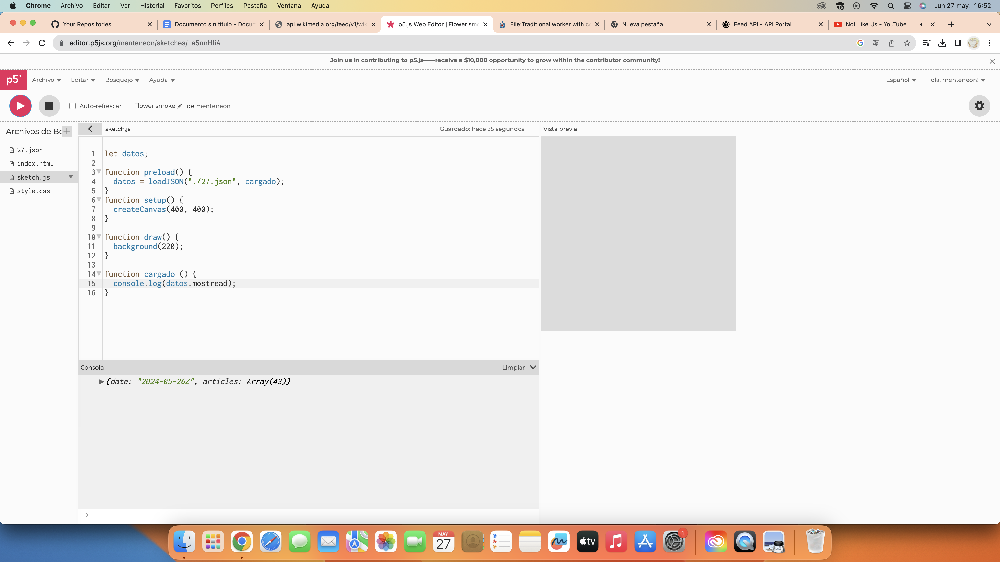
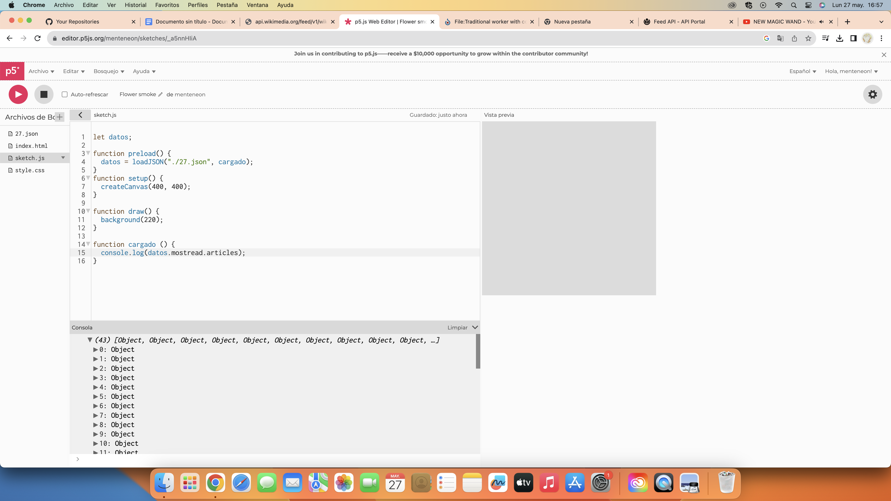
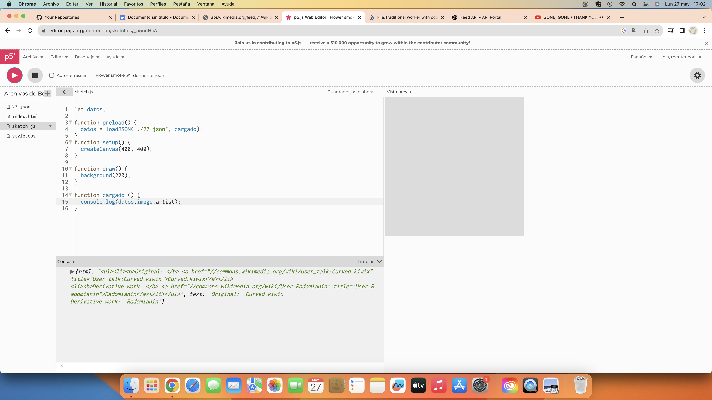
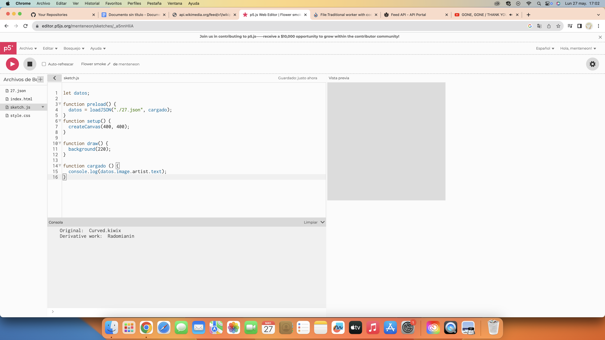

# clase-11

## Json
* JSONLINT-> para probar JSON

* Tienen parámetros y sus valores
```
{
	“name”: “John” ,
	“age”: 30,
	“car”: null
}
```

* Hay que colocar entre comillas las palabras que no son órdenes 

* NO se le coloca la coma al último valor 


## WIKIPEDIA 

* Wikipedia API 

* Se puede crear una cuenta en Wikipedia 

* Probar API en p5.js, pruebas en las images posteriores 







