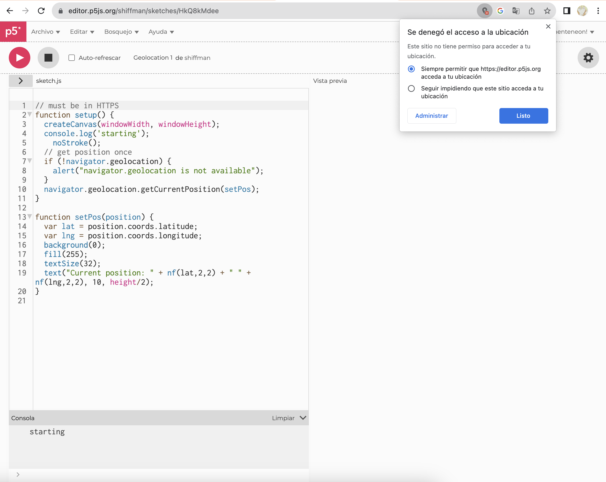
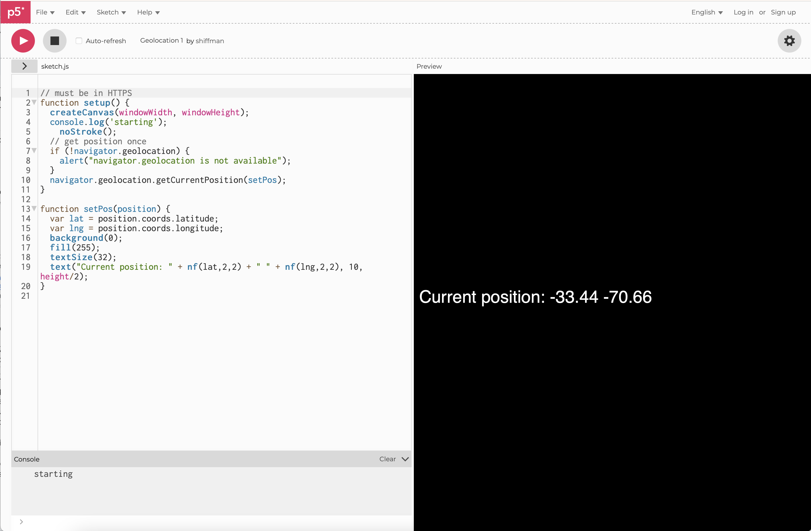
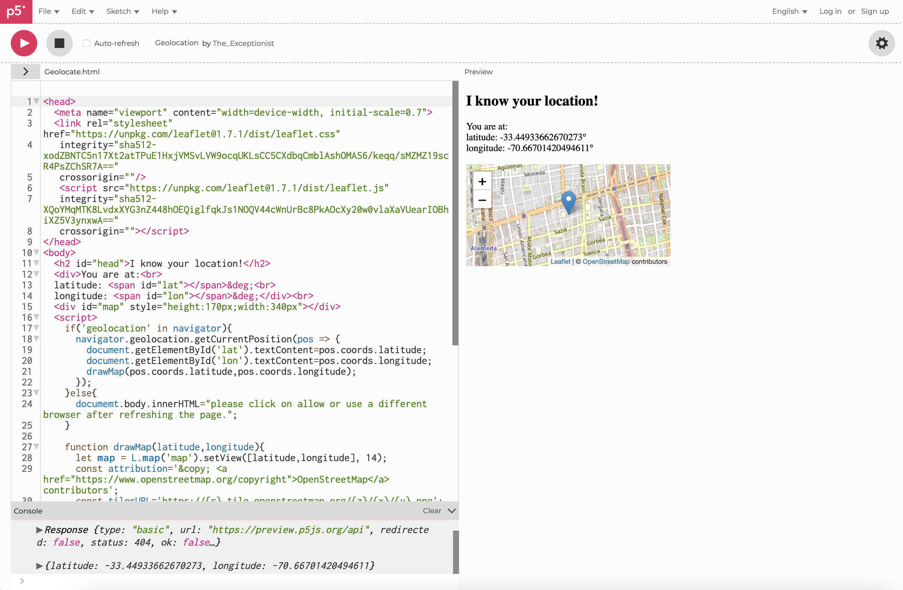

# clase-14

Investigaciòn sobre p5.geolocation, una librería de p5.js tiene técnicas para adquirir, observar, calcular y geocercas ubicaciones, esto desde p5.js

La creaciòn e investigaciòn fue gracias a Forecast Public Art y Jerome Foundation, tambien se le hace un agradecimiento especial a Derek Anderson 

Por otro lado se debe correr en el navegador para emular 

Al entrar a su Github podemos ver que la actualización más reciente fue hace 6 años y algunas carpetas que no han sido actualizadas en 9 años, esto hace que sea altamente probable que tenga errores. D hecho hay ingresar al README de su Github podemos ver un aviso importante que nos puede alertar de esto 

Su traducción    seria: 

IMPORTANTE: tenga en cuenta que Google, Mozilla, Apple y Microsoft están en el proceso de prohibir varias funciones de las páginas web que se sirven desde HTTP en lugar de HTTPS (http seguro)(https://sites.google.com/a/ chromium.org/dev/Home/chromium-security/deprecating-powerful-features-on-insecure-origins) Aún puedes hacer esto, pero debe estar sobre "orígenes seguros" (como HTTPS) y esto se puede hacer mediante obtención de un certificado SSL. Visite letsencrypt.org para obtener una opción abierta y gratuita, o comuníquese con su proveedor de alojamiento para ver cómo se puede hacer.

Cómo utilizar 

Si la geolocalizacion esta disponibles es verdadero 
Si es falso es porque no está disponible 

¿Funciona?

Al intentar hacerlo funcionar en Chrome no funciona, pero es por la razón que hay que dar un permiso desde la configuración del computador y no tengo acceso a la contraseña de administración del computador 

Hay otra variación de Geolocalizacion la cual da unos mapas al momento de encontrar la latitud y longitud 

Por otro lado lo intente desde Safari porque vi que en los permisos del computador se encuentran disponibles el permiso de ubicación desde Safari y aquí si funciono 

