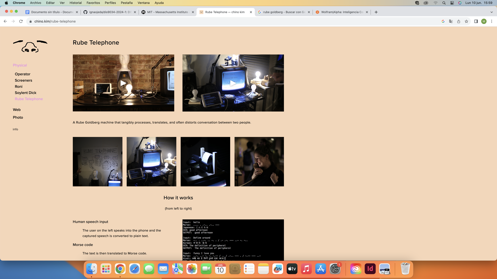

# clase-13

Clase 10 de junio
Apuntes de clase

Recap de lo que hemos visto

Referentes vistos en clase:

https://chino.kim/ - Rude Telephone 
Proyecto en conjunto con el Profe Aaron

 

Rude Goldberg - caricaturas, escritor y escultor

https://www.wolframalpha.com/ - web para buscar muchos datos e diferentes cosas

Bit y Byte (son diferentes)

Bit (binary digit) : Según esta definición, un bit es un dígito del sistema de numeración binario, que se representa con dos valores, el 0 y el 1.

Byte (8 bits): Un byte equivale a un conjunto ordenado de 8 bits. El byte es la unidad de información estándar utilizada en informática y en telecomunicaciones. Un byte equivale a un conjunto ordenado de 8 bits.

Investigación de recursos a usar en el examen, decidir que quiero hacer y programar para el examen

Processing sounds

Examples:

https://processing.org/examples/sequential.html  – Ver este referente a ver si se puede llegar a hacer algo así para el examen, o quizá sea muy ambicioso 

https://editor.p5js.org/p5/sketches/Sound:_Sound_Effect 
https://imaginary-institute.com/the-course.html
