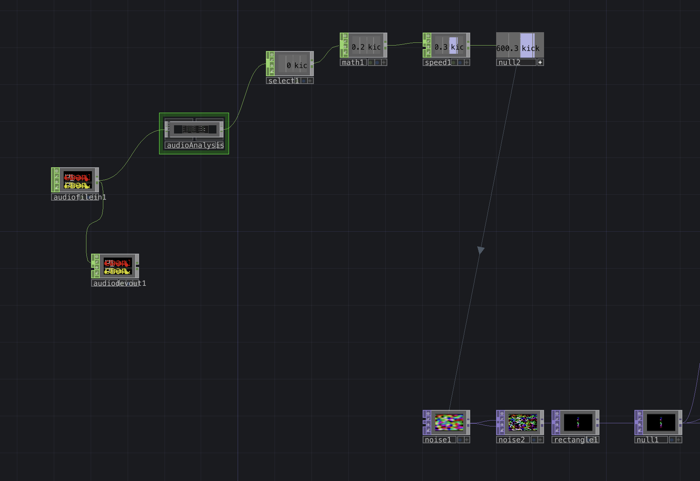
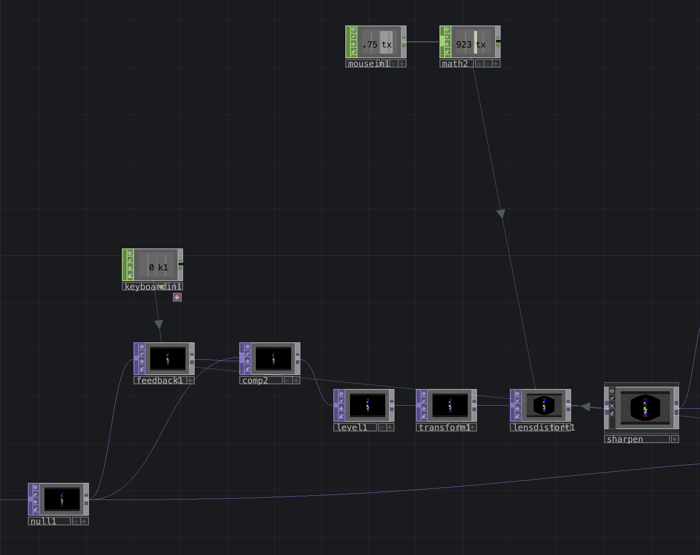
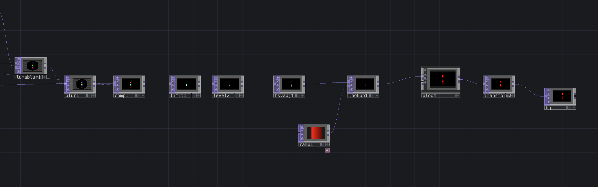

# clase-15

## EXAMEN PROGRAMACIÓN CREATIVA MULTIMEDIA: FEEDBACK Y DISTORCIÓN DEL LENTE

- Este proyecto consiste en visuales reactivas al kick del track de fondo, las cuales también interactúan con el teclado al presionar el 1, generando un efecto de feedback y con una distorción del lente que sigue la posición del mouse.

- Realizado en TouchDesigner V2022.32120, con la aplicación de distintos parametros y nodos de información que delimitan los datos necesarios para que el proyecto sea interactivo.

### Proceso

- Logré que el noise que se ve en el proyecto fuera audioreactivo pasando el archivo de audio del track que elegí (Phara - The Wall) por un AudioAnalysis, separando el kick, Snare y Rythm para luego seleccionar solo el kick, pasandolo por un nodo matemático, luego unos ajustes de velocidad para finalmente convertirlo en una referencia para la velocidad del noise.

- Conecté la figura principal a un nodo de feedback que funciona presionando la tecla 1, para luego pasarlo por variados efectos hasta el Lensdistort, que tiene como referencia de la posición K1 el eje x del mouse.

- Fui agregando más efectos para lograr el resultado final, entre ellos se encuentra Bloom que vendría siendo el que le da un brillo a las figuras que se mueven.

## Referencias

- Proyecto "Feedback & lens distort" por Elekktronaut, (Link ref. <https://www.elekktronaut.com/tutorials/feedback-and-lens-distort>)

Aprendí a sacarle el provecho a estos elementos de Touchdesigner gracias al tutorial mencionado y, luego, comencé a ajustarlo a mi manera para lograr una mayor interactividad y para acercarlo más a un estilo gráfico personal.
  
Video Demostración:
<https://vimeo.com/967167198?share=copy>
