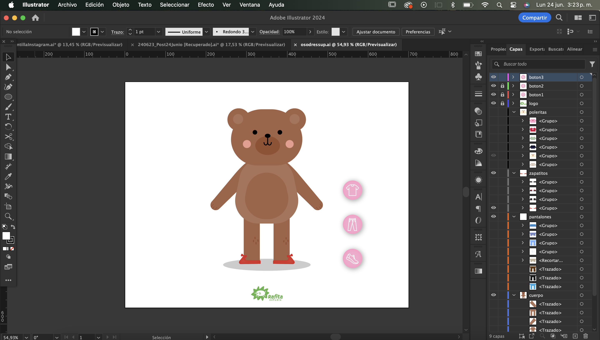
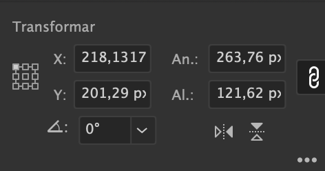
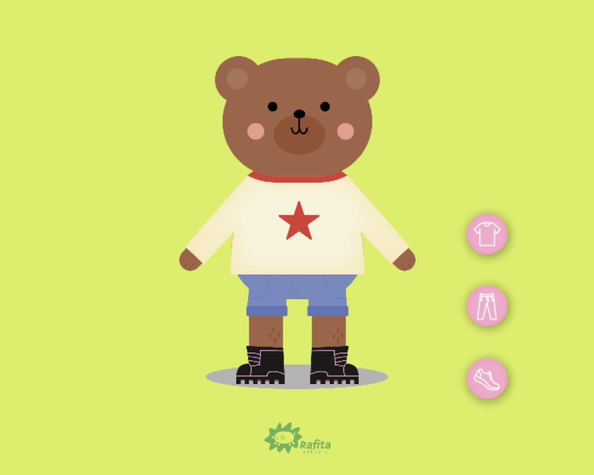

# clase-15

## dress up game

puedes acceder a mi examen AQUI <https://editor.p5js.org/danielasalamanca/sketches/fptcbXC_F>

### idea del proyecto

el objetivo de mi proyecto es crear un código en p5.js que funcione como un juego de vestir a un personaje, mediante el uso de botones el usuario podrá elegir la polera del personaje, los pantalones y sus zapatitos

### antes de programar

1. antes de escribir el código, cree una mesa de trabajo en illustrator del mismo tamaño que utilizaría para el canvas de p5

2. dibujé con vectores a mi personaje que definí que sería un oso y posteriormente dibujé distintas prendas de ropa

    

3. exporté las imágenes y las renombré

### proceso del código

1. declaramos las variables que almacenan el índice (index) de la prenda actual, este se utilizará para saber cuál imagen de polera está actualmente seleccionada

    ```javascript
    let currentPolera;
    let currentPantalon;
    let currentZapatitos;
    ```

2. definir los arrays que almacenarán las posiciones **x** e **y** de cada prenda

    ```javascript
    // dado que cada prenda tiene posiciones distintas necesitaré definirlas
    // estos arrays almacenarán las posiciones x e y de cada prenda
    let poleraPositions = [];
    let pantalonPositions = [];
    let zapatitosPositions = [];
    ```

3. cargamos las imágenes que vamos a utilizar, que son: el logo, el cuerpo del oso, la sombra, 6 poleras, 5 pantalones y 4 zapatitos en la sección preload().

    ```javascript
      logo = loadImage("logo.svg");
      oso = loadImage("oso.png");
      sombra = loadImage("sombra.png");
      polera1 = loadImage("polera1.png");
      polera2 = loadImage("polera2.png");
      polera3 = loadImage("polera3.png");
      polera4 = loadImage("polera4.png");
      polera5 = loadImage("polera5.png");
      polera6 = loadImage("polera6.png");
      pantalon1 = loadImage("pantalon1.png");
      pantalon2 = loadImage("pantalon2.png");
      pantalon3 = loadImage("pantalon3.png");
      pantalon4 = loadImage("pantalon4.png");
      pantalon5 = loadImage("pantalon5.png");
      zapatitos1 = loadImage("zapatitos1.png");
      zapatitos2 = loadImage("zapatitos2.png");
      zapatitos3 = loadImage("zapatitos3.png");
      zapatitos4 = loadImage("zapatitos4.png");
    ```

4. definimos arrays para almacenar las imágenes cargadas y posteriormente loop para cargar y almacenar las imágenes de las poleras, pantalones y zapatitos

    ```javascript
    // arrays para almacenar las imágenes cargadas
      poleras = [];
    // loop para cargar y almacenar las imágenes de las 6 poleras
      for (let i = 1; i <= 6; i++) {
        poleras.push(loadImage(`polera${i}.png`));
      }

    // arrays para almacenar las imágenes cargadas
      pantalones = [];
    // loop para cargar y almacenar las imágenes de los 5 pantalones
      for (let i = 1; i <= 5; i++) {
        pantalones.push(loadImage(`pantalon${i}.png`));
      }

    // arrays para almacenar las imágenes cargadas
      zapatitos = [];
    // loop para cargar y almacenar las imágenes de los 4 zapatitos
      for (let i = 1; i <= 4; i++) {
        zapatitos.push(loadImage(`zapatitos${i}.png`));
      }
    ```

5. dentro de setup() creamos un canvas de 700x560 píxeles

    ```javascript
    function setup() {
    // crea un lienzo de 700x560 píxeles
      createCanvas(700, 560);
    ```

6. inicializamos las variables de la prenda actual

    ```javascript
    // inicializa las variables de la prenda actual
      currentPolera = 0;
      currentPantalon = 0;
      currentZapatitos = 0;
    ```

7. definimos la posición en la que deberían ir cada una de las poleras para que estas calcen en el cuerpo del osito, hacemos lo mismo con los pantalones y zapatos. Para saber la posición x e y de las prendas, al igual que la altura y ancho, me guié por las medidas que trabajé en mi archivo illustrator

    

    ```javascript
    // define la posición en la que deberían ir cada una de las poleras para que estas calcen en el cuerpo del osito
      poleraPositions = [
        { x: 219, y: 201 },
        { x: 251, y: 201 },
        { x: 250, y: 201 },
        { x: 218, y: 201 },
        { x: 219, y: 201 },
        { x: 218, y: 201 },
    ];

    // define la posición en el que deberían ir cada uno de los pantalones para que estos calcen en el cuerpo del osito
      pantalonPositions = [
        { x: 261, y: 305 },
        { x: 273, y: 303 },
        { x: 273, y: 304 },
        { x: 273, y: 303 },
        { x: 273, y: 303 },
      ];

    // define la posición en el que deberían ir cada uno de los zapatitos para que estos calcen en el cuerpo del osito
      zapatitosPositions = [
        { x: 278, y: 425 },
        { x: 279, y: 420 },
        { x: 281, y: 426 },
        { x: 278, y: 407 },
      ];
    ```

8. creamos los botones para cambiar las poleras, pantalones y zapatitos, estos botones los haré a partir de una imagen

    ```javascript
    // crea un botón a partir de una imagen para cambiar la polera
      buttonPolera = createImg("1boton.png");
    // establece la posición del botón
      buttonPolera.position(533, 235);
    // asigna la función 'changePolera' al hacer clic en el botón
      buttonPolera.mousePressed(changePolera);

    // crea un botón a partir de una imagen para cambiar los pantalones
      buttonPantalon = createImg("2boton.png");
    // establece la posición del botón
      buttonPantalon.position(533, 320);
    // asigna la función 'changePantalon' al hacer clic en el botón
      buttonPantalon.mousePressed(changePantalon);

    // crea un botón a partir de una imagen para cambiar los zapatitos
      buttonZapatitos = createImg("3boton.png");
    // establece la posición del botón
      buttonZapatitos.position(533, 405);
    // asigna la función 'changeZapatitos' al hacer clic en el botón
      buttonZapatitos.mousePressed(changeZapatitos);
    ```

9. dentro de draw() definimos el color de fondo `background(217, 239, 86);`

10. proyectamos las imágenes de la sombra, del osito y del logo en el canvas, debido a que las exporté en 300 ppp quedaron muy grandes y también deberé ajustar sus tamaños.

    ```javascript
    // dibuja y redimensiona la sombra
      image(sombra, 242, 429);
      sombra.resize(215, 29);
    // dibuja y redimensiona la figura del oso
      image(oso, 211, 66);
      oso.resize(278, 383);
    // dibuja y redimensiona el logo
      image(logo, 311, 497);
      logo.resize(78, 37);
    ```

11. seleccionamos la imagen actual de los zapatitos

    ```js
      let currentZapatitosImage = zapatitos[currentZapatitos];
    ```

12. obtenemos la posición actual de los zapatitos que definimos anteriormente

    ```javascript
    let zapatitosPos = zapatitosPositions[currentZapatitos];
    ```

13. redimensionamos cada una de las imágenes de los zapatitos según el índice actual

    ```javascript
    if (currentZapatitos === 0) {
        currentZapatitosImage.resize(144, 28);
      } else if (currentZapatitos === 1) {
        currentZapatitosImage.resize(142, 31);
      } else if (currentZapatitos === 2) {
        currentZapatitosImage.resize(137, 25);
      } else if (currentZapatitos === 3) {
        currentZapatitosImage.resize(144, 45);
      }
    ```

14. dibujamos la imagen de los zapatitos en la posición especificada

    ```javascript
      image(currentZapatitosImage, zapatitosPos.x, zapatitosPos.y);
    ```

15. repetimos los pasos 11, 12, 13 y 14 pero con los pantalones y las poleras

    ```javascript
    let currentPantalonImage = pantalones[currentPantalon];
      let pantalonPos = pantalonPositions[currentPantalon];
      if (currentPantalon === 0) {
        currentPantalonImage.resize(177, 61);
      } else if (currentPantalon === 1) {
        currentPantalonImage.resize(154, 69);
      } else if (currentPantalon === 2) {
        currentPantalonImage.resize(154, 127);
      } else if (currentPantalon === 3) {
        currentPantalonImage.resize(154, 70);
      } else if (currentPantalon === 4) {
        currentPantalonImage.resize(154, 127);
      }
      image(currentPantalonImage, pantalonPos.x, pantalonPos.y);

      let currentPoleraImage = poleras[currentPolera];
      let poleraPos = poleraPositions[currentPolera];
      if (currentPolera === 0) {
        currentPoleraImage.resize(261, 129);
      } else if (currentPolera === 1) {
        currentPoleraImage.resize(197, 115);
      } else if (currentPolera === 2) {
        currentPoleraImage.resize(199, 115);
      } else if (currentPolera === 3) {
        currentPoleraImage.resize(264, 122);
      } else if (currentPolera === 4) {
        currentPoleraImage.resize(262, 129);
      } else if (currentPolera === 5) {
        currentPoleraImage.resize(264, 122);
      }
      image(currentPoleraImage, poleraPos.x, poleraPos.y);
    }
    ```

16. con la función para cambiar la polera `function changePolera()`podremos actualizar el índice ´currentPolera´ para cambiar a la siguiente polera

17. al incrementar el valor actual de 'currentPolera' en 1 se moverá el índice a la siguiente polera. El modulo operator o resto (%) se usará para asegurar que el índice vuelva a 0 cuando alcance el final de la lista de poleras

18. `poleras.length` es el número total de poleras que tengo (6)

    ```js
      currentPolera = (currentPolera + 1) % poleras.length;
    ```

19. repetimos los pasos 16 y 17 con los pantalones y los zapatitos

    ```js
    // función para cambiar el pantalón
    function changePantalon() {
      currentPantalon = (currentPantalon + 1) % pantalones.length;
    }

    // función para cambiar los zapatitos
    function changeZapatitos() {
      currentZapatitos = (currentZapatitos + 1) % zapatitos.length;
    }
    ```

y listo!!! ya puedes vestir al osito!



### referentes

- mi referente de como crear y utilizar arrays: <https://happycoding.io/tutorials/p5js/arrays>, especialmente en como declararlos `let circleY = [];` y también para utilizarlos para loops considerando que quería que las prendas volvieran a empezar desde la primera al pasar la última

```javascript
for (let i = 0; i < 5; i++) {
  circle(50 * (i+1), circleY[i], 25);
```

- array functions: <https://happycoding.io/tutorials/p5js/array-functions#push>
- referente de como utilizar una imagen como botón: <https://gist.github.com/lizzybrooks/54045563e4e8321718cc40297db999f9>
- usar el modulo operator: <https://keepcoding.io/blog/operador-modulo-en-javascript/>
- el logo utilizado pertenece a @rafita.studio
