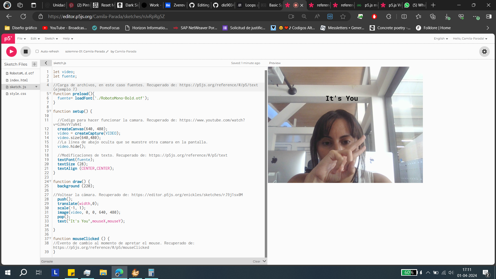
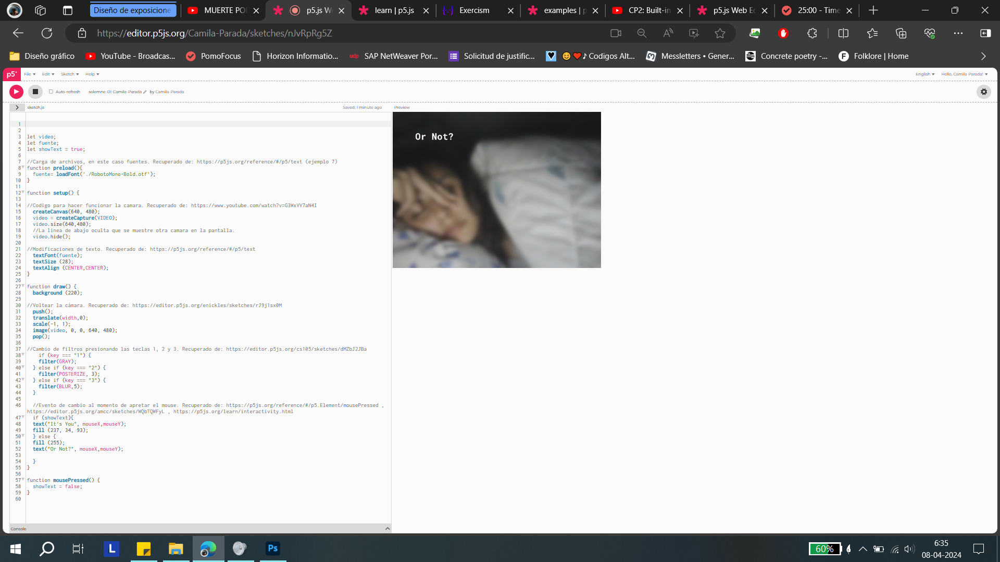

# ⋆₊˚⊹♡ Clase 05 - Solemne 01 ♡⊹˚₊⋆
###### _LUNES 8/04/2024_

***
 
### Observaciones

<!---Recordar para programar "md" (markdown): 
- https://github.com/adam-p/markdown-here/wiki/Markdown-Cheatsheet 
- https://www.markdownguide.org/basic-syntax/--->
Entrega del primer encargo. Este consiste en usar lo aprendido en las anteriores clases para desarrollar un código con p5js.

- [Clase 02](https://github.com/disenoUDP/dis9034-2024-1/tree/main/clases/clase-02): uso de la consola web, creación de variables (var {antiguo} y let), declaración de variable (nombre, valor o significado), arreglos o "array": grupos de valores distintos de una misma variable), [bucles o loop](https://developer.mozilla.org/en-US/docs/Web/JavaScript/Guide/Loops_and_iteration): iteraciones o repeticiones continuas.
- [Clase 03](https://github.com/disenoUDP/dis9034-2024-1/tree/main/clases/clase-03): condicionales, pixeles, imagenes externas, sintaxis de funciones.

***
 
### Descripción del proyecto
Creación de una "web" que use la cámara del computador a la par que muestre un texto en el puntero del mouse. Al momento de hacer click se cambia el texto anterior por uno nuevo, con otro color. Esta interacción con el mouse, "click con el botón", permite que el usuario pueda activar las teclas númericas "1", "2" o "3" (no es una condición establecida en el código, lo detallo basado en mi experiencia al probar el prototipo) para poder modificar la imagen de la cámara con los filtros "GRAY", "POSTERIZE y "BLUR". La idea base es incitar la reflexión acerca de la perdida de identidad que ocurre en los entornos digitables, quienes nublan y alteran la imagen que percibimos de nuestro ser, en este caso literalmente a través de la alteración visual por los filtros.

 

- Conocimiento: "let,if, else if" (variables), preload, loadFont, createCapture (video), hide, text, key (teclado), filters.

 

#### *LINK DEL PROYECTO ONLINE*: https://editor.p5js.org/Camila-Parada/sketches/nJvRpRg5Z 

***

### Paso a paso

La primera etapa consistio en saber cómo aplicar la cámara en el editor (p5js), por lo que revisé tutoriales la semana pasada (25/03) y volví a aplicar el código del video "Uso de cámara". Tras intentar aplicarlo me di cuenta que el código no corría, por lo que intenté revisar a qué se debía. Lo modifiqué revisando otros proyectos, y más tarde me di cuenta que no se podía iniciar dado que la aplicación de "cámara" de mi computador estaba en uso. Tras desactivarlo el código funcionó sin problemas. Una vez que obtuve la solución quise añadir un detalle del puntero del mouse con texto. Para no usar las tipografías base, pude indagar y obtener unas "líneas" que me enseñaban a como implementar una fuente externa. Una vez establecido este recurso y ver que el funcionamiento estuviera "ok", fue el comienzo para investigar en como mostrar los "filtros" de las imágenes aplicados a la cámara. Esta fase fue la más compleja, puesto que el proceso de prueba y error requerría de la creación de variables (no usadas hasta ahora) y pese a basarme en códigos ya existentes (ejemplos que me inspiraron o tenían similitudes) no conseguía de forma satisfactoria. Y otra vez, de vuelta a empezar. Al final di con un proyecto de un chico que expone distintos filtros a una misma imagen usando las teclas numericas del equipo. Esto fue aplicado en la línea 35, adaptando los parámetros. Ya concretada mi idea base desarrollé interés de generar una interacción usando el botón del mouse, puesto que no lo conseguí aplicar para cambiar los filtros. Busqué realizar una modificación en el texto del puntero, alterando el color y cambiando las palabras anteriormente mostradas. Por fortuna, esta última idea fue más fácil de aplicar.

***

### Galería
 

▼ El puntero no se ve en la captura desde el equipo, pero se encuentra debajo del texto.

 

▼ Captuna aplicando el filtro "3": BLUR. A la par, el texto del puntero se modificó al hacer click.

***

### Referencias e inspiración

- Uso de cámara. Recuperado de: https://www.youtube.com/watch?v=G3WxVV7aN4I
- Modificación de fuentes digitales (subir una fuente en otf, cambiar tamaño, centrarla): https://p5js.org/reference/#/p5/text
- Cambio de colores. Recuperado de: https://www.geeksforgeeks.org/p5-js-mouseclicked-function/
- Ejercicio de sobreposición de texto ante un sketch. Recuperado de: https://stackoverflow.com/questions/41434313/placing-text-on-top-of-a-sketch-in-p5-js
- Video reflectado. Recuperado de: https://editor.p5js.org/enickles/sketches/rJ9j1sx0M
- Efecto de espejo. Recuperado de: https://editor.p5js.org/icm4.0/sketches/wP4mP8Ij4
- Cambios al hacer click. Recuperado de: https://www.geeksforgeeks.org/p5-js-mouseclicked-function/
- Edición de tipografía y texto. Recuperado de: https://p5js.org/reference/#/p5/text
- Interactividad. Recuperado de: https://p5js.org/learn/interactivity.html
- Ocultar texto. Recuperado de: https://editor.p5js.org/amcc/sketches/WQbTQWFyL
- Uso de botones del teclado y cambio de filtros. Recuperado de: https://editor.p5js.org/cs105/sketches/dMZbJ2JBa

***
### Posdata

"PLS" que me vaya bien, me esforcé intentando construir estos códigos (ᗒᗣᗕ)՞. Fue un largo proceso de prueba y error, caida y aprendizaje, rebuscar y probar.
Me cuesta aprender, pero intento ponerle mucho empeño ૮◞ ﻌ ◟ა

***
 ##### *°˖✧◝(⁰▿⁰)◜✧˖°*
