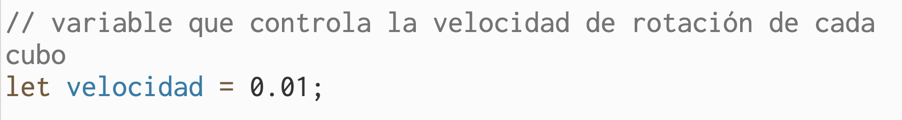
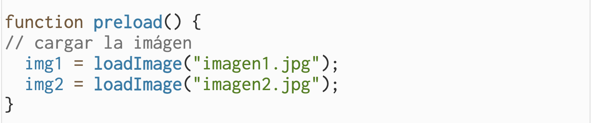

# clase-05

Cambio de idea al de la clase pasada, mantengo la idea de querer hacer un cubo con imágenes pero quiero poder hacer una interacción con el mouse, para que estos se muevan guiados por el mouse. Esto en base a un referente pero modificando la idea y complejizandola un poco, intentar hacerlo.

Primer avance

Tome el referente como idea y fui modificando de apoco para lograr mi idea, cambiando la forma a una forma de cubo 3d,usando WEBGL guiándome con un video en youtube (link en codigo referente)
Tambien usé la funcion translate y rotate para posicionar y rotar los cubos en el espacio 3D (siguiendo la idea de lo que estaba haciendo la clase pasada)

https://editor.p5js.org/ignaojeda/full/-BX4gmyCs // link de archivo p5js

Lunes 08/04

Pude agregar la imágen que quería a uno de los cubos

Agregue imagenes a los dos cubos y cambie la primera imágen por otra

https://editor.p5js.org/ignaojeda/sketches/F1Vnp4MzP

Explicación de algunas funciones

Variables que indican las imágenes

Variable que controla el valor de la velocidad de los cubos

Imágenes cargadas
