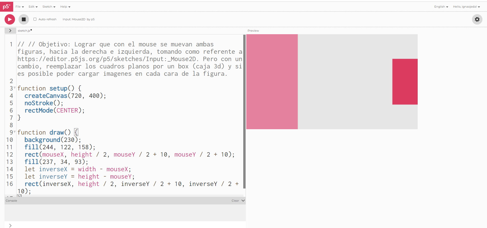
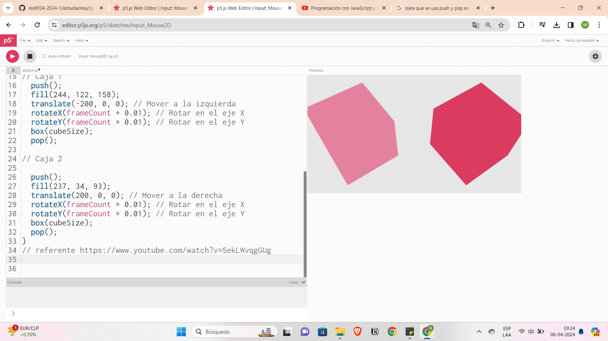
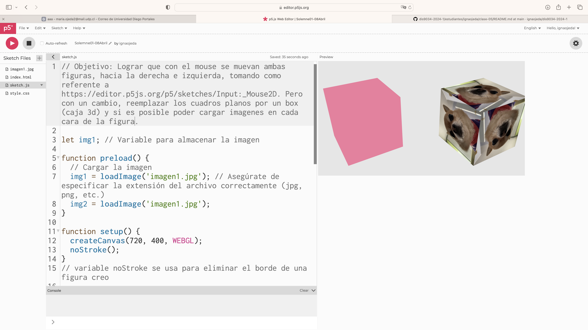
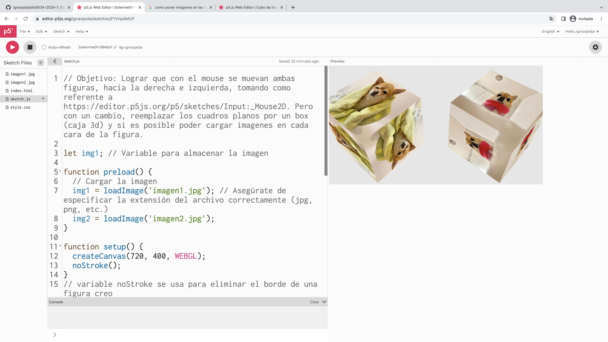

# clase-05

Cambio de idea al de la clase pasada, mantengo la idea de querer hacer un cubo con imágenes pero quiero poder hacer una interacción con el mouse, para que estos se muevan guiados por el mouse. Esto en base a un referente pero modificando la idea y complejizandola un poco, intentar hacerlo.

Primer avance

Tome el referente como idea y fui modificando de apoco apra lograr mi idea, cambiando la forma a una forma de cubo 3d,usando WEBGL guiandome con un video en youtube (link en codigo referente)
Tambien use la funcion translate y rotate para posicionar y rotar los cubos en el espacio 3D (siguiendo la idea de lo que estaba haciendo la clase pasada)

https://editor.p5js.org/ignaojeda/full/-BX4gmyCs // link de archivo p5js

Lunes 08/04

Pude agregar la imágen que quería a uno de los cubos

Agregue imagenes a los dos cubos y cambie la primera imagen por otra

https://editor.p5js.org/ignaojeda/sketches/F1Vnp4MzP

En base a lo que hice la clase pasada, cambie lo que queria hacer, si quiero mantener la idea de un box como figura y que sea con imagenes, quiero hacer que este se mueva guiado por el movimiento del mouse, en base a un referente que vi (https://editor.p5js.org/p5/sketches/Input:_Mouse2D) pero quiero poder lograr complejizarlo un poco (si lo logro) haciendo que estas cajas tengan imagenes en cada una de sus caras o al menos en una de cada caja.

1°Avance : 
