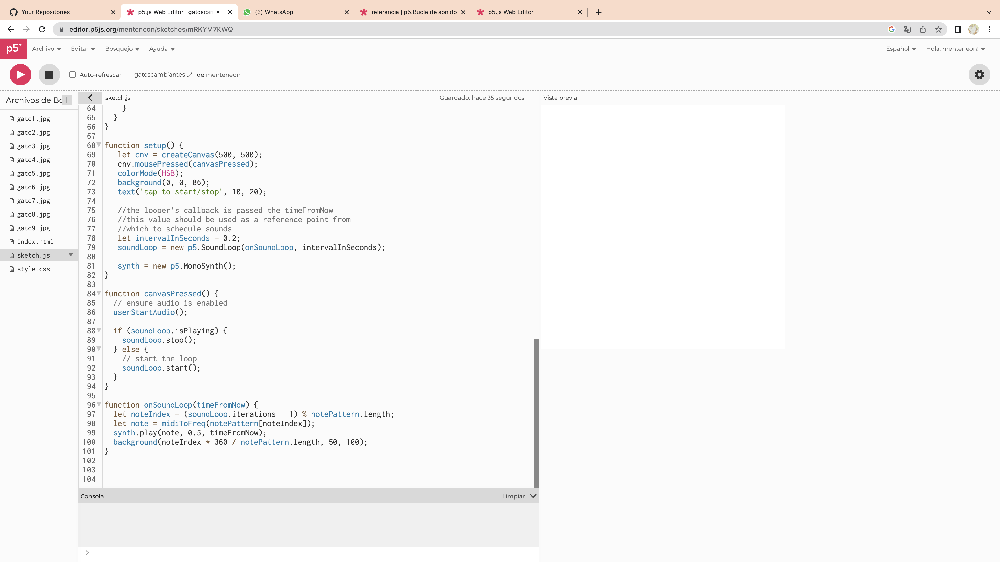
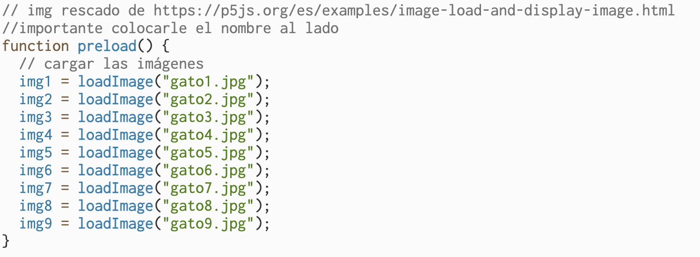

# clase-05
## Solenme 1 

* El siguiente trabajo  a presentar trata sobre imágenes que están predeterminadas por las teclas numéricas del teclado físico, estas imágenes aparecerán al mismo tiempo que se presiona la tecla. Pero también al momento de presionar el canvas en blanco comienza a sonar una melodìa de fondo. 

* La melodia se rescato de https://p5js.org/reference/#/p5.SoundLoop   para poder hacer funcionar la melodía en el código se debe colocar una biblioteca en index.html    biblioteca de melodías
* La melodía se puede cambiar la velocidad y el tono de la melodía

* Comando de KeyIsPressed está rescatado de https://p5js.org/reference/#/p5/keyIsPressed 

* Comando KeyIsPressed para las imagenes rescatados de https://editor.p5js.org/ehagan/sketches/dlcBuy7NC 

* Las imágenes tiene filtros, estos fueron rescatados de https://p5js.org/reference/#/p5.Image/filter 

* Link directo al trabajo https://editor.p5js.org/menteneon/sketches/mRKYM7KWQ

## MODO DE USO 

* Al principio del codigo se comenzo colocando "let" para designar ciertas condiciones
* En estos let se pueden ver como se designan nombres especificos a las img, como tambien se le da el tonos a las melodias y el loop 
  

* Lineas de codigos en donde se agregan imagenes p5.js, recordar que hay que subir la foto y colocar exactamente el mismo nombre de donde se sube
  

*Aqui es donde se pone en funciòn el KeyIsPressed, aqui es cuando se le determina a cada tecla numerica una imagen 

* En esta parte del codigo esta determinado como funciona la melodia de fondo y se estipula que al presionar con el mouse comienza la melodia y cuando se presiona de nuevo se pausa

